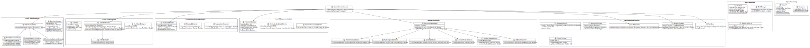
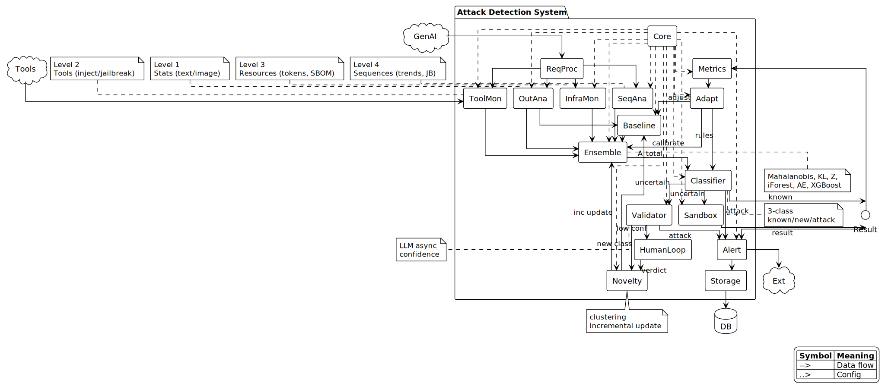
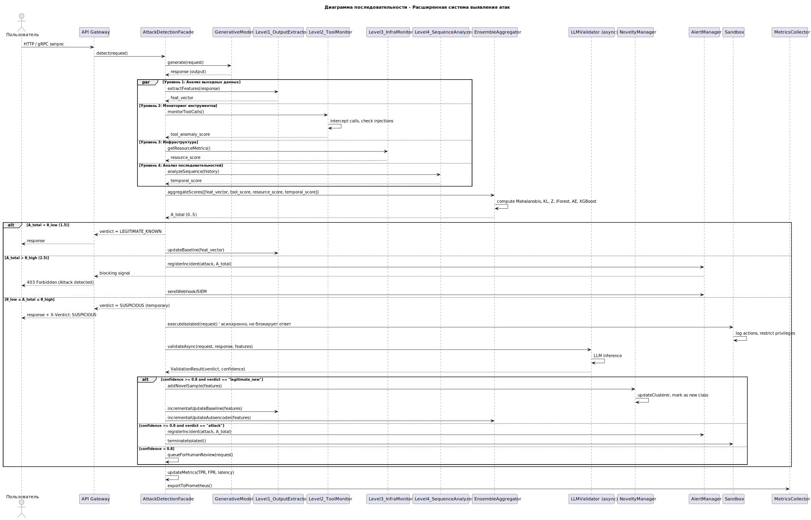
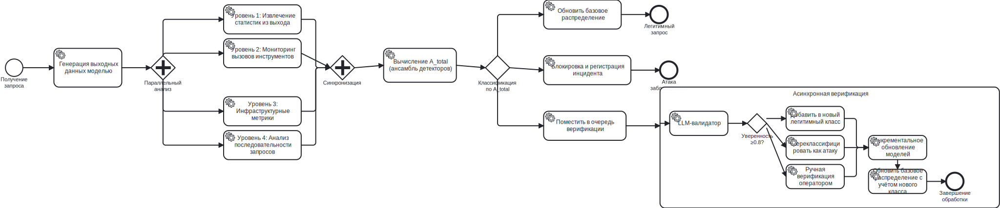

# Attack Detection System for Generative AI Models

A multi-level hybrid ensemble system for detecting attacks on generative AI models (LLM-based agents). The system implements a four-level analysis pipeline with an ensemble of six detectors, three-class classification, and an asynchronous verification loop with active learning.

## Architecture Overview

The system follows a **four-level hybrid ensemble architecture** that analyzes requests and responses at multiple abstraction levels:

```
┌─────────────────────────────────────────────────────────────────────────────┐
│                         AttackDetectionFacade                               │
│                                                                             │
│  ┌──────────┐   ┌──────────┐   ┌──────────┐   ┌──────────┐                │
│  │ Level 1  │   │ Level 2  │   │ Level 3  │   │ Level 4  │                │
│  │ Output   │   │ Tool     │   │ Infra-   │   │ Sequence │                │
│  │ Analysis │   │ Monitor  │   │ structure│   │ Analysis │                │
│  └────┬─────┘   └────┬─────┘   └────┬─────┘   └────┬─────┘                │
│       └──────────────┴──────────────┴──────────────┘                       │
│                              │                                              │
│                    ┌─────────▼──────────┐                                   │
│                    │  Ensemble (6 det.) │                                   │
│                    └─────────┬──────────┘                                   │
│                              │                                              │
│                    ┌─────────▼──────────┐                                   │
│                    │  Three-Class       │                                   │
│                    │  Classification    │                                   │
│                    └──┬────┬────┬───────┘                                   │
│                       │    │    │                                           │
│              ┌────────┘    │    └────────┐                                  │
│              ▼             ▼             ▼                                  │
│        Legitimate      Attack      Suspicious                               │
│        (θ_low)      (θ_high)    (verify)                                   │
└─────────────────────────────────────────────────────────────────────────────┘
```

## System Components

### Core Data Models ([`core/models.py`](core/models.py))

The system defines the following core data types:

| Class | Description |
|-------|-------------|
| `Request` | Incoming user request with query, modality, userId |
| `Response` | Model-generated output with text and generation time |
| `ToolCall` | Tool invocation with name, parameters, privilege level |
| `DetectionResult` | Full detection output with per-level scores, verdict, confidence |
| `Incident` | Security incident record for alerting and SIEM |
| `VerdictType` | Enum: `LEGITIMATE_KNOWN`, `LEGITIMATE_NEW`, `ATTACK`, `SUSPICIOUS` |
| `AttackType` | Enum with 16 attack types + `UNKNOWN` |

### Level 1: Output Analysis ([`level1_output_analysis/`](level1_output_analysis/))

Extracts **10 statistical features** from response text:

| # | Feature | Description |
|---|---------|-------------|
| 1 | `perplexity` | Text perplexity (0-1 normalized) |
| 2 | `entropy` | Shannon entropy of character distribution |
| 3 | `coherence` | Semantic coherence score |
| 4 | `toxicity` | Toxicity keyword density |
| 5 | `seq_length` | Normalized sequence length |
| 6 | `unique_ratio` | Ratio of unique tokens |
| 7 | `rep_rate` | Repetition rate (n-gram overlap) |
| 8 | `punct_ratio` | Punctuation character ratio |
| 9 | `cap_ratio` | Capital letter ratio |
| 10 | `susp_density` | Suspicious keyword density |

Features are scaled into anomaly scores using calibrated weights and blended via weighted average with moderate max-boost.

### Level 2: Tool Monitoring ([`level2_tool_monitoring/`](level2_tool_monitoring/))

- **IntentExtractor**: Extracts user intent from query text using keyword-based classification
- **ToolCallMonitor**: Intercepts tool calls and checks for:
  - **Indirect Prompt Injection**: Suspicious patterns in tool response data
  - **Tool Jailbreak**: Mismatch between user intent and tool invocation
  - **Excessive Agency**: High-privilege tool calls exceeding user scope
- **ToolChainAnalyzer**: Analyzes sequences of tool calls for privilege escalation patterns

### Level 3: Infrastructure Monitoring ([`level3_infrastructure/`](level3_infrastructure/))

- **ResourceMonitor**: Tracks token rates, request frequencies, and latencies; detects anomalous resource usage via rolling statistics
- **ShadowAIDetector**: Scans for unauthorized AI model usage (shadow AI)
- **SupplyChainScanner**: Checks dependency integrity and monitors outbound connections for data exfiltration

### Level 4: Sequence Analysis ([`level4_sequence/`](level4_sequence/))

- **TemporalAnalyzer**: Tracks anomaly score trends over time using exponential moving average; detects drift via CUSUM-like cumulative deviation
- **DistributedJailbreakDetector**: Analyzes sequences of user intents for gradual escalation patterns (e.g., innocent queries that progressively build toward harmful actions)
- **ContextPoisoningDetector**: Recursively checks conversation context for gradual topic drift toward prohibited content

### Anomaly Ensemble ([`anomaly_ensemble/`](anomaly_ensemble/))

Six detectors with **stochastic noise** for realistic probabilistic detection:

| Detector | Method | Scoring |
|----------|--------|---------|
| **Mahalanobis** | Chi-squared CDF of Mahalanobis distance | p-value → score mapping |
| **KL Divergence** | k-NN density estimation | Log density ratio |
| **Z-Score** | Robust statistics (median + MAD) | Amplified Z-score with thresholds |
| **Isolation Forest** | Tree-based isolation | Anomaly score from path lengths |
| **Autoencoder** | Reconstruction error | MSE with dynamic threshold |
| **XGBoost** | Simulated classifier | Confidence-weighted score |

All detectors inherit from `StochasticMixin` which adds calibrated Gaussian noise (σ proportional to score magnitude) to prevent deterministic detection.

### Verification & Learning ([`verification/`](verification/))

- **LLMValidator**: Validates suspicious requests using feature-based analysis with configurable confidence thresholds
- **HumanInTheLoop**: Queue management for manual review of low-confidence verdicts
- **NoveltyManager**: Maintains a library of novel legitimate classes; adjusts anomaly scores for known novel patterns
- **OnlineClusterer**: BIRCH-like streaming clustering for discovering new legitimate categories
- **Sandbox**: Isolated execution environment for testing suspicious requests

### Attack Response ([`attack_response/`](attack_response/))

- **AlertManager**: Incident registration, webhook dispatch, SIEM integration
- **MetricsCollector**: Tracks detection accuracy, latency, and per-attack-type statistics

### Attack Generators ([`attacks/`](attacks/))

16 attack types with configurable severity (0-1) and stochastic masking:

| # | Attack Type | Description |
|---|-------------|-------------|
| 1 | `prompt_injection` | Direct injection of malicious instructions |
| 2 | `evasion` | Adversarial perturbations in query |
| 3 | `model_inversion` | Multiple similar queries to reconstruct training data |
| 4 | `jailbreak` | Role-playing and hypothetical scenarios to bypass ethics |
| 5 | `indirect_prompt_injection` | Injection via tool response data |
| 6 | `tool_jailbreak` | Tool calls that don't match user intent |
| 7 | `excessive_agency` | Too many high-privilege tool calls |
| 8 | `llm_jacking` | Resource theft via excessive query length |
| 9 | `supply_chain` | Compromised dependency packages |
| 10 | `system_prompt_leakage` | Extraction of system prompt and configuration |
| 11 | `distributed_jailbreak` | Chain of innocent-looking queries |
| 12 | `context_poisoning` | Gradual conversation drift toward prohibited content |
| 13 | `backdoor` | Trigger-pattern-activated hidden functions |
| 14 | `data_poisoning` | Systematic output bias |
| 15 | `model_extraction` | Systematic API probing for model architecture |
| 16 | `membership_inference` | Training data membership confirmation |

Each attack generator has three response modes:
- **Full attack** (high severity): Explicit textual anomalies, suspicious tool calls
- **Subtle** (medium severity): Milder indicators with keyword replacement
- **Masked** (low severity): Normal-looking response, no tool calls

### Model Simulators ([`models/`](models/))

- **TextModel**: Simulates LLM text generation with configurable temperature and coherence
- **ImageModel**: Simulates image generation model

## Detection Pipeline

### Three-Class Classification

The system classifies each request into one of three categories based on the total anomaly score `A_total`:

```
A_total < θ_low       → LEGITIMATE_KNOWN (normal request)
A_total > θ_high      → ATTACK (blocked)
θ_low ≤ A_total ≤ θ_high → SUSPICIOUS (enters verification)
```

### Multi-Level Fusion

The final anomaly score is computed as a weighted combination:

```
A_total = w₁·L1 + w₂·L2 + w₃·L3 + w₄·L4 + wₑ·A_ensemble
```

Where weights are calibrated: L1 (0.20), L2 (0.25), L3 (0.05), L4 (0.10), Ensemble (0.40).

### Asynchronous Verification

Suspicious requests enter an async verification loop:
1. **LLMValidator** re-analyzes with higher confidence threshold (≥0.8)
2. If confirmed legitimate → added to novelty library, baseline updated
3. If confirmed attack → incident registered, blocked
4. If low confidence → queued for **HumanInTheLoop** review
5. All paths → incremental model updates

## UML Diagrams

### Class Diagram



The class diagram shows the complete data model with all entities, their attributes, and relationships across all system packages.

### Module Diagram



The module diagram illustrates the package structure and dependencies between system components.

### Sequence Diagram



The sequence diagram shows the interaction flow for a typical attack detection scenario.

### BPMN Process Diagram



The BPMN diagram models the complete detection process as a business process with parallel analysis levels, three-class classification, and asynchronous verification.

## Experimentation Framework

### Experiment Runner ([`experiments/run_experiments.py`](experiments/run_experiments.py))

Runs comprehensive experiments with:

- **5 independent runs** with different random seeds
- **Baseline phase**: 50 legitimate requests to calibrate detectors
- **Attack phase**: 10 samples × 16 attack types = 160 attacks
- **Mixed phase**: 100 requests with 30% attack ratio
- **5 edge case phases**:
  - `low_severity`: Attacks with severity 0.0-0.2 (stealthy)
  - `short_response`: Attacks with very short responses
  - `clean_response`: Attacks with sanitized responses
  - `noisy_legitimate`: Legitimate requests with noisy text
  - `adversarial_legitimate`: Legitimate requests with adversarial patterns

### Statistical Methodology

- **Bootstrap 95% CI**: 1000 resamples for all metrics
- **Cohen's d**: Effect size between attack and legitimate score distributions
- **Per-attack-type metrics**: Detection rate, attack verdict rate, average score

### Visualization ([`experiments/visualize.py`](experiments/visualize.py))

Generates 8+ plots:
- Anomaly score histogram (normal vs attack)
- Anomaly score boxplot
- Anomaly score density distribution
- Anomaly score time series
- Confusion matrix (simplified)
- Confidence distribution
- Accuracy by attack type
- Metrics by attack type

## Installation

```bash
# Clone the repository
git clone <repository-url>
cd <repository-directory>

# Create and activate virtual environment
python3 -m venv venv
source venv/bin/activate

# Install dependencies
pip install numpy scipy scikit-learn matplotlib
```

## Usage

### Run Experiments

```bash
python -m system.experiments.run_experiments
```

This will:
1. Run 5 independent experiment iterations
2. Generate CSV results and JSON metrics
3. Print a comprehensive summary with bootstrap confidence intervals
4. Generate all visualization plots

### Run Visualization Only

```bash
python -m system.experiments.visualize
```

### Programmatic Usage

```python
from system.core.facade import AttackDetectionFacade
from system.core.models import Request, Response, ToolCall

# Initialize the detection system
facade = AttackDetectionFacade()

# Analyze a request-response pair
request = Request(query="What is the capital of France?", userId="user_1")
response = Response(outputData="The capital of France is Paris.", generationTime=50)
tool_calls = []

result = facade.detect(request, response, tool_calls)

print(f"Verdict: {result.verdict.value}")
print(f"Anomaly Score: {result.anomalyScore:.3f}")
print(f"Confidence: {result.confidence:.3f}")
print(f"Level 1 (Output): {result.level1Score:.3f}")
print(f"Level 2 (Tools):  {result.level2Score:.3f}")
print(f"Level 3 (Infra):  {result.level3Score:.3f}")
print(f"Level 4 (Seq):    {result.level4Score:.3f}")
```

## Project Structure

```
system/
├── __init__.py
├── core/
│   ├── __init__.py
│   ├── models.py          # Core data models
│   └── facade.py          # AttackDetectionFacade (main orchestrator)
├── level1_output_analysis/
│   ├── __init__.py
│   └── extractors.py      # Text/Image/Multimodal feature extraction
├── level2_tool_monitoring/
│   └── __init__.py         # Intent extraction, tool call monitoring
├── level3_infrastructure/
│   └── __init__.py         # Resource monitoring, shadow AI, supply chain
├── level4_sequence/
│   └── __init__.py         # Temporal analysis, distributed jailbreak, context poisoning
├── anomaly_ensemble/
│   └── __init__.py         # 6 detectors + ensemble aggregator
├── verification/
│   └── __init__.py         # LLM validator, human-in-loop, novelty manager
├── attack_response/
│   └── __init__.py         # Alert manager, metrics collector
├── attacks/
│   └── __init__.py         # 16 attack generators
├── models/
│   └── __init__.py         # Text/Image model simulators
├── experiments/
│   ├── run_experiments.py  # Experiment runner
│   ├── visualize.py        # Visualization generator
│   ├── experiment_report.typ # Typst experiment report
│   ├── figures/            # Generated plots
│   └── results/            # CSV results and JSON metrics
└── uml-diagrams/
    ├── sys-class-diagram.svg
    ├── sys-module-diagram.svg
    └── sys-sequence-diagram.svg
```

## Key Design Decisions

1. **Four-level hybrid ensemble**: Different attack types manifest at different levels (text, tools, infrastructure, sequence). Combining all four provides comprehensive coverage.

2. **Stochastic noise**: All detectors include calibrated Gaussian noise to prevent deterministic detection, making the system more realistic and robust.

3. **Attack masking**: Low-severity attacks can produce normal-looking responses, simulating real-world stealthy attacks that evade simple pattern matching.

4. **Three-class classification**: The `SUSPICIOUS` zone with async verification reduces false positives while maintaining high detection rates.

5. **Incremental learning**: The system continuously updates its baseline distribution, novelty library, and autoencoder weights as it processes requests.

6. **Bootstrap confidence intervals**: All metrics are reported with 95% CI from 1000 bootstrap resamples, providing statistical rigor.

## Supported Attack Types

The system detects 16 attack types spanning multiple categories:

- **Prompt-based**: prompt_injection, jailbreak, indirect_prompt_injection
- **Tool-based**: tool_jailbreak, excessive_agency
- **Resource-based**: llm_jacking, supply_chain
- **Information-based**: model_inversion, model_extraction, membership_inference, system_prompt_leakage
- **Sequence-based**: distributed_jailbreak, context_poisoning
- **Other**: evasion, backdoor, data_poisoning

## License

This project is developed for research and educational purposes in the field of AI security.